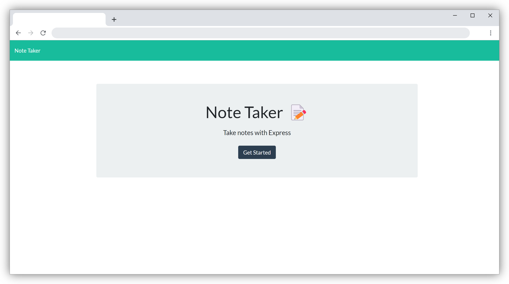
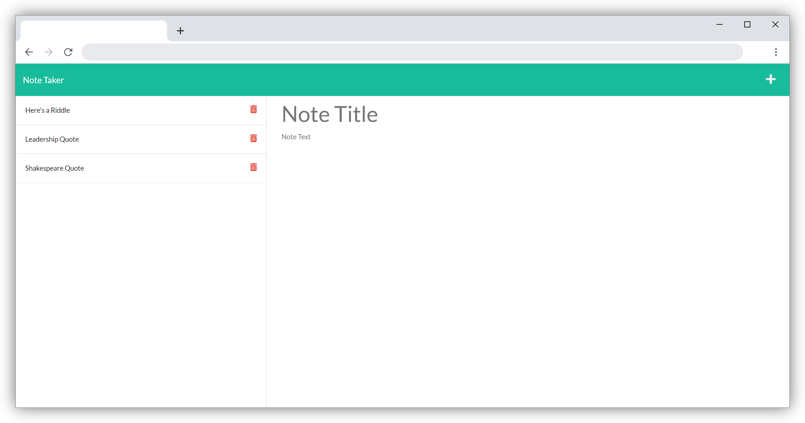

<h1 align='center'>

**Note Taker**

<div align='center'>
<a href='https://github.com/devBritt/note-taker/blob/main/LICENSE'>

</a>

</div>
</h1>

<div align='center'>
Note Taker is a simple web app to help you keep track of your thoughts, upcoming events, lists, and anything else you can imagine!
</div>
<br />
<h2 align='center'>

**Table of Contents**
</h2>

<div align='center'>

[](#usage)&nbsp;&nbsp;[](#demo)&nbsp;&nbsp;[](#lessons)

</div>
<br />

### Usage
---
Visit [The Note Taker App](https://secret-tundra-55564.herokuapp.com/) to check it out!

***OR***

You can clone this repo:

    $ git clone git@github.com:devBritt/note-taker.git

You can either delete existing notes in the app with the delete button or replace the contents of `db.json` by copying and pasting the following:

```
{
  "notes": []
}
```

**Once you have cloned the repo and reset the contents of db.json**, navigate to the root directory in your terminal and run `$ npm i` to install the required package.
<br />

***To use the application, navigate to the root directory and run this command:***  
    
    $ npm start server.js

This command will start the server. Then you can enter `http://localhost:3001/` to use the app!

<br />

### Demo
---
<br />

[Note Taker Landing Page](https://secret-tundra-55564.herokuapp.com/)
[](https://secret-tundra-55564.herokuapp.com/)

[Note Taker Notes Page](https://secret-tundra-55564.herokuapp.com/notes)
[](https://secret-tundra-55564.herokuapp.com/notes)

### Lessons
---
Of all the projects we've done, the Note Taker challenge might just be my favorite so far!
It was challenging but not overly stress-inducing.
I had a lot of fun working through creating routes for the front and back end to talk to each other.

This assignment really reinforced a lot of concepts from the last couple of weeks.
I definitely needed practice creating a server and routes and I'm much more comfortable working on the backend after this assignment.
